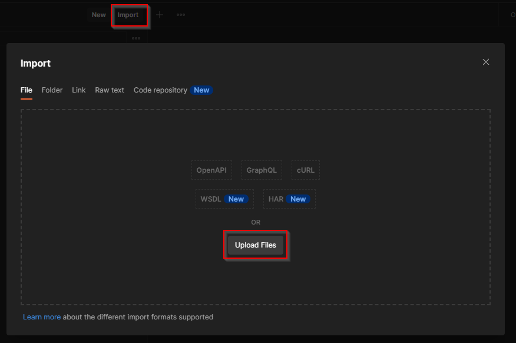
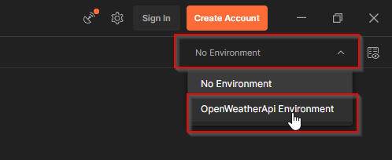
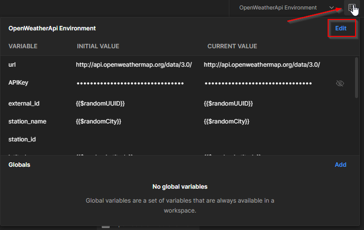
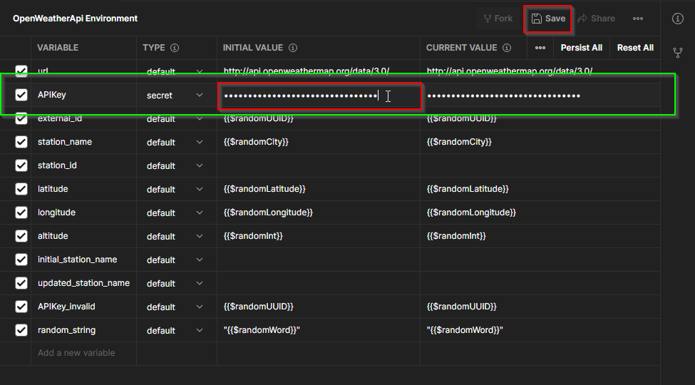
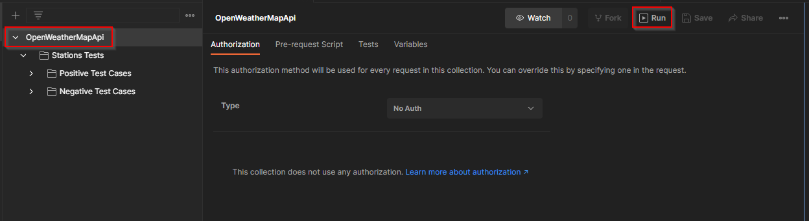
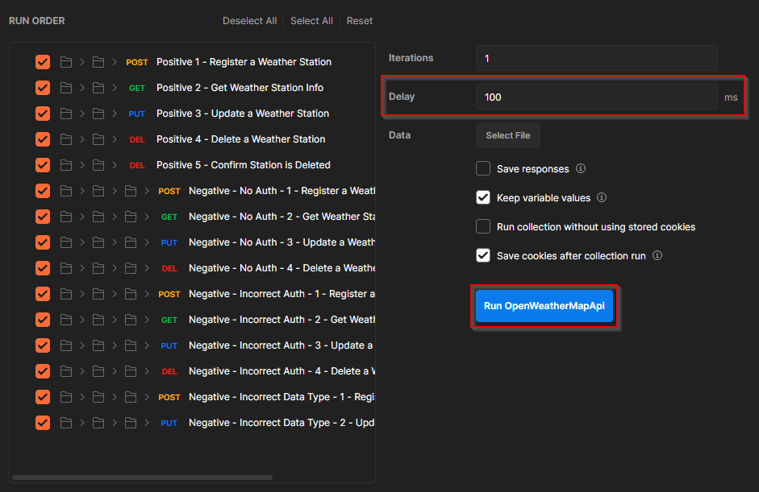
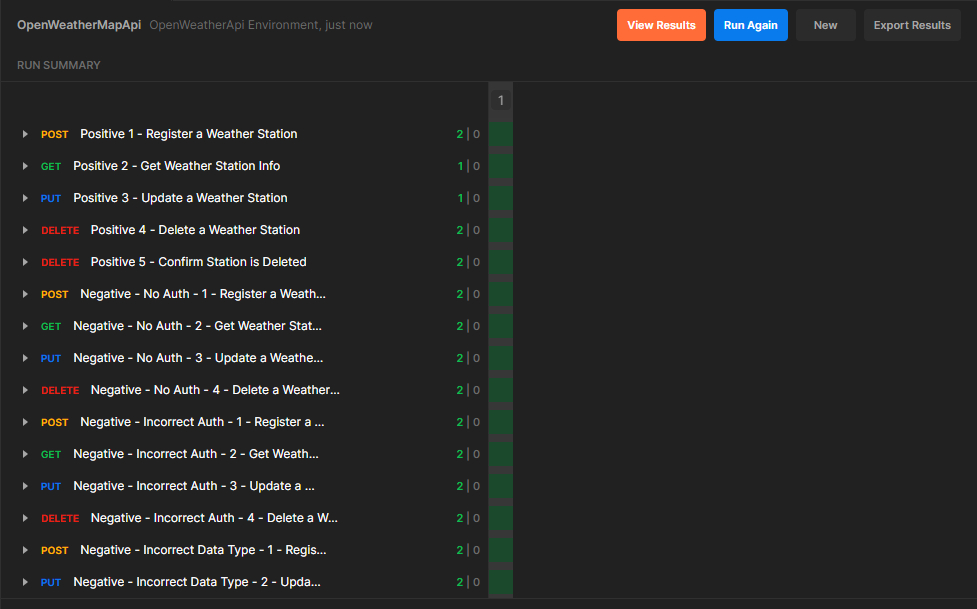

<p align="center">
  <a href="" rel="noopener">
 </a>
</p>

<h3 align="center">Automation-Postman-OpenWeatherMapApi</h3>

<div align="center">

[]()
[](https://github.com/yushirm/Automation-Selenium-SauceDemo/issues)
[](https://github.com/yushirm/Automation-Selenium-SauceDemo/pulls)

</div>

---

A test automation project using the Postman that targets [Open Weather Map Api](https://openweathermap.org/api) site.

## 📝 Table of Contents

- [About](#about)
    - [Test Design Approach](#test-design-approach-a-name--testdesigna)
- [Getting Started](#getting_started)
- [Usage](#usage)
- [Tools Used](#built_using)
- [TODO](./TODO.md)
- [Authors](#authors)

## 🧐 About <a name = "about"></a>

The purpose of this project is to show how I would create and manage a Postman Test collection and Environment. The project consists of functional tests for the Open Weather Map Api website, specifically, using automation to simulate expected REST API interactions.

### Test Design Approach <a name = "test_design"></a>
Tests were created to emulate both positive and negative interactions against the Api. Positive interactions simulate typical Api use, such as the Addition, Modification, Retrieval and Deletion of data. Negative interactions simulate non-standard use, such as omission of data, incorrect data types and incorrect authorizations. 

The initial tests target [Weather Stations](https://openweathermap.org/stations) functionality, and go through the motions of creating, modifying and removing a station. The tests also evaluate how gracefully this endpoint handles unexpected data (e.g. trying to modify a station without proper authorization).

## 🏁 Getting Started <a name = "getting_started"></a>
This section outlines what you will need to run the tests locally.

### Prerequisites
This test solution was built and run using the following:
- Windows OS
- Postman

### Installing
<b>Cloning the repository</b>

Create clone of the repository on your local machine via command-line or other management tool.

```
$ git clone https://github.com/yushirm/Automation-Postman-OpenWeatherApi/
```

<b>Installing Postman</b>

You can download Postman from [Here](https://www.postman.com/download/).
- Run the installer and sign-in if necessary

<b>Importing Collection and Environment variables</b>

- Click on the <b>Import</b> button at the top of the window
- Click <b>Upload Files</b>



- Open the following two files:
    - ".\Postman.Collection\OpenWeatherMapApi.postman_collection.json"
    - ".\Postman.Environment\OpenWeatherApi Environment.postman_environment.json"

- Once loaded, switch to the test environment by clicking on the Environment drop down and selecting <b>OpenWeatherApi Environment</b>



<b>Generating and Updating Open Weather Map API Key</b>

Open Weather Map requires that users register before making changes via the API. Users receive an API Key when registering that allows API access. You can register and obtain a key [here](https://openweathermap.org/appid#signup).

- You will need to update the Postman Environment with your generated key.
- Click on the <b>Environment Icon</b> and then on <b>Edit</b>



- You can then paste you key in the <b>Initial Value</b> column in the <b>APIkey</b> row. Be sure to click on <b>Save</b>.



You are now ready to run your tests 😊.


## 🔧 Running the tests <a name = "tests"></a>
### Postman Runner
Postman has a built in test runner for running collections.

- Select the <b>OpenWeatherMapApi</b> collection. Click the <b>Run</b> button. (You may need to close the <b>Documentation</b> panel if you can't see the button).



- Postman allows you to set a static delay between requests. You can set this if you like.
- Click the <b>Run OpenWeatherMapApi</b> button to start the test.



- The test run window will appear and begin iterating through all the tests.
- Green indicates a Pass and Red for Fail.
- You can select requests to see the Asserts used.



## ⛏️ Tools Used <a name = "built_using"></a>
- [Postman](https://www.postman.com/) - v9.31.0

## ✍️ Authors <a name = "authors"></a>
- [yushirm](https://www.linkedin.com/in/yushir-rugnath-maharaj-44b86222/) - Initial design and coding